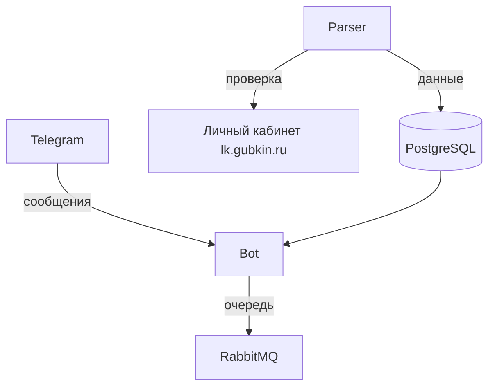

# notification_bot

### Telegram-бот, который мониторит баллы студентов из личного кабинета lk.gubkin.ru и присылает им уведомления об изменениях.

---

## ⚙️ Быстрый запуск

1. Клонируйте репозиторий:

    ```bash
    git clone https://github.com/itsvovovovova/notification_bot.git
    cd notification_bot
    ```

2. Создайте `.env` файл:

    ```bash
    # Обязательные
    BOT_TOKEN=
    FERNET_KEY=

    # RabbitMQ
    rabbitmq_host=rabbitmq
    rabbitmq_port=5672
    rabbitmq_management_port=15672

    # PostgreSQL
    postgres_host=db
    postgres_port=5432
    postgres_user=postgres
    postgres_password=postgres
    postgres_db=notification_bot

    # Приложение
    app_port=8007
    app_host=0.0.0.0
    ```

3. Запустите сервисы:

    ```bash
    docker-compose up --build -d
    ```

4. Откройте Telegram и введите команду /start

---

## 📊 Диаграмма



🔍 Что умеет сервис?
1. Авторизация через ваш аккаунт ЛК

2. Проверка оценок каждые 30 секунд

3. Мгновенные Telegram-уведомления

4. Шифрование всех пользовательских данных